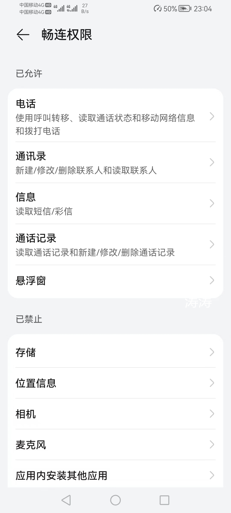
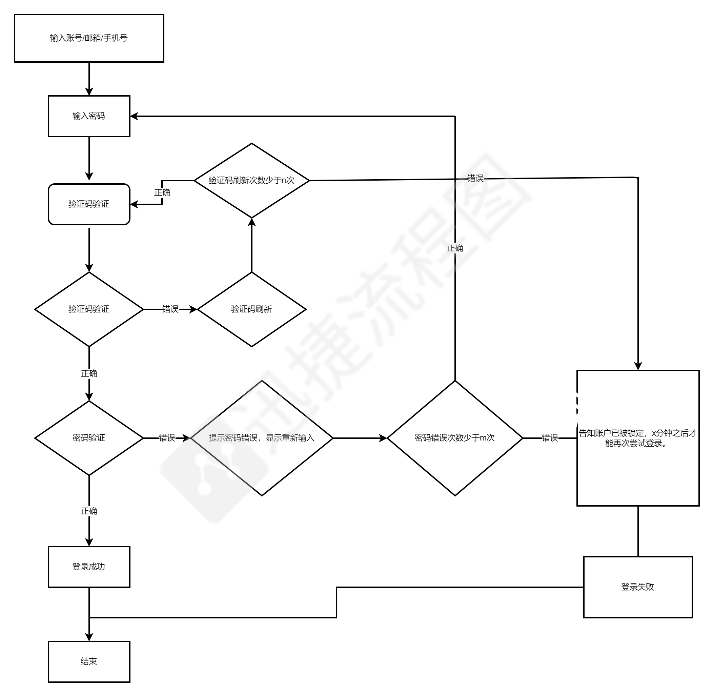

# 操作系统的访问控制设计实例研究

## 实验目的

- 以 `IOS` 和 `Android` 系统为研究对象，对操作系统的访问控制进行研究。

## 实验环境

- 操作系统版本：`Harmony OS 2.0.0`
- 手机版本信号：`DVC-TN20`

## 实验结果

### 主要实验内容

#### 当系统处于锁屏状态下接收到新短信时，不解锁情况下

- 系统是否允许查看短信内容？`是`

- 系统是否允许回复短信？`否，需要先解锁手机`

- 安卓上的 App : 以 `畅联` 为例，在接管了系统短信功能和权限之后，是否会有一些不同的功能设定？`会显示需要修改手机默认设置，若使用系统自带，则仍然只可读而不可回复`。

#### 当系统处于锁屏状态下，使用系统内置（例如 iOS 的 Siri ）或第三方的语音助手可以完成以下哪些操作？Harmony 小艺

- 访问通讯录 `否`

- 拨打电话 `否`

- 访问相册 `否`

- 查看短信收件箱 `否`

`均显示需要先解锁手机`

#### 实验并分析指纹识别相比较于简单密码、复杂密码、图形解锁、人脸识别解锁、声纹解锁等解锁方式的安全性、便利性差异 

| **密码类型** | **安全性**                                               | **便利性**                                           |
| ------------ | -------------------------------------------------------- | ---------------------------------------------------- |
| 简单密码     | 小于指纹解锁，可被分析破解或者统计破解                   | 容易记住，比较方便                                   |
| 复杂密码     | 分析破解更不容易，但是安全性还是没有指纹高               | 输入较为麻烦，记忆也不方便                           |
| 图形解锁     | 有可能被穷举分析，指纹则不存在此种攻击方式               | 解锁需要画图，相较指纹不容易                         |
| 人脸识别解锁 | 人脸识别主要是特征识别，安全性在特征唯一的情况下可以保证 | 方便，只需要人脸对着摄像头即可，但是可能受光线的影响 |
| 声纹解锁     | 容易伪造                                                 | 需要说话，在安静的环境不方便                         |
| 指纹解锁     | 指纹不容易出现重复，复制指纹不容易实现，安全性较好       | 比较方便，手指一按就解锁，但是有时候手湿会影响准确性 |

- 以上设计实现方式属于我们课堂上讲过的哪种强制访问控制模型？`Lattice/BLP`？`Biba`？
    - `Biba`模型，可以上读下写，锁屏时只能读短信，属于上读；解开屏幕以后，可以回复短信，属于下写。

- 系统或第三方应用程序是否提供了上述功能的访问控制规则修改？如果修改默认配置，是提高了安全性还是降低了安全性？
    - 是，例如`百度网盘`，可以修改权限。我认为是降低了安全性，相当于脱离了操作系统的控制。我们可以通过对不同App应用赋予不同的权限控制从而实现不同层级的安全性控制。
    

### 思考题

#### 生物特征身份认证方式有哪些？优缺点分析？应用场景举例。

- 虹膜识别技术
    - 优点：便于用户使用；可能会是最可靠的生物识别技术，尽管它还没有测试过；只需用户位于设备之前而无需物理的接触。

    - 缺点：一个最为重要的缺点是它没有进行过任何的测试，当前的虹膜识别系统只是用统计学原理进行过小规模的试验，而没有进行过现实世界的唯一性认证试验；很难将图像获取设备的尺寸小型化；因聚焦的需要而需要昂贵的摄像头；镜头可能会使图像畸变，而使得可靠性大为降低；黑眼睛极难读取；需要一个比较好的光源。
    - 应用场景：门禁考勤：扫描虹膜就能实现通道控制、开/锁门的和考勤管理，虹膜考勤识别迅速，无需接触，不能被假冒和替代打卡；社保生存认证：虹膜识别养老金发放中的生存认证系统具有独特性、不可替代性、防假冒和生物活性等特性，可以准确无误的掌握生存人数，解决养老金发放中的异地验证问题及冒领、冒用甚至骗保等社保难题，有效提高了办事效率，防止错误发生；网络安全：借助虹膜技术提供互联网保护，确保用户登陆、计算机、在线交易及信息安全，如微软的Windows10用虹膜识别代替密码登录。

- 视网膜识别技术
    - 优点：视网膜是一种极其固定的生物特征，因为它是“隐藏“的，故而不可能磨损、老化或是为疾病影响；使用者不需要与设备进行直接的接触；这是一个最难欺骗的系统，因为视网膜是不可见的，故而不会被伪造。

    - 缺点：视网膜技术未经过任何测试,很明显，视网膜技术可能会给使用者带来健康的损坏，这需要进一步的研究；对于消费者，视网膜技术没有吸引力；很难进一步降低它的成本。
    - 应用场景：视网膜识别技术是一种非主流的生物识别产品

 - 面部识别
    - 优点：面部识别是非接触的，用户不需要与设备直接的接触；可以使用桌面的视频摄像，且比较高级的摄像头还可以有效高速地捕捉面部图像。

    - 缺点：使用者面部的位置与周围的光环境都可能影响系统的精确性；大部分研究生物识别的人都公认面部识别是最不准确的，也是最容易被欺骗的；面部识别技术的改进依赖于提取特征与比对技术的提高，并且采集图像的设备会比其技术昂贵得多；对于因人体面部的如头发、饰物、变老以及其他的变化可能需要通过人工智能来得到补偿，机器学习功能必须不断地将以前得到的图像和现在得到的进行比对，以改进核心数据和弥补微小的差别；很难进一步降低它的成本，我们必需以昂贵的费用去卖高质量的设备。
    - 应用场景： 人脸属性识别：可以通过图像快速建立客户画像数据库并进行大数据画像，从而实现精准营销；人脸特征定位：对于识别出来的人脸图像区域的五官进行精准定位，得到图片中人脸五官的坐标和特征值。产品应用上最主流的是社交的常用产品图片美颜和娱乐类换脸；人脸比对：目前发展到可以实现视频流和图片的比对，以及多种传感器所传入的脸部信号的比对；

- 签名识别
    - 优点：使用签名识别更容易被大众接受，而且这是一种公认的身份识别的技术。
    - 缺点：随着经验的增长，性情的变化与生活方式的改变，签名也会随着而改变；为了处理签名不可辟免的自然改变，我们必须在安全方面做以妥协；因为签名的速度不快，我们无法在Internet上使用它；用于签名的手写板结构复杂而且价格昂贵，因为和笔记本电脑的触摸板分辨率有着很大的差异，我们在技术上很难将两者结合起来；很难将它的尺寸小型化。
    - 应用场景：上课签到；借条、合同等重要文件签名防抵赖；

- 声音识别
    - 优点：声音识别也是一种非接触的识别技术，用户可以很自然地接受。
    - 缺点：与其他的行为识别技术一样，声音因为变化的范围太大，故而很难进行一些精确的匹配；声音会随着音量、速度和音质的变化(例如当你感冒时)而影响到采集与比对的结果；随着技术的发展，也许你可以觉察和拒绝录音的声音，然而，目前来说，我们还很容易用磁带上的声音来欺骗声音识别系统。
    - 应用场景：电子声控；语音拨号；语音监听；语音导航；即时翻译。

- 指纹识别

    - 优点：识别速度最快，应用最方便；推广容易、应用最为广泛、适应能力强；误判率和拒真率低：指纹是人体独一无无二的特征，并且它们的复杂度足以提供用于鉴别的足够特征；稳定性和可靠性强：如果要增加可靠性，只需登记更多的指纹、鉴别更多的手指，最多可以多达十个，而每一个指纹都是独一无二的；易操作，无需特殊培训既可使用；安全性强，系统扫描对身体无害；指纹具备再生性；可持续的发展性：指纹采集头可以更加小型化，并且价格会更加的低廉；
    - 缺点：对环境的要求很高，对手指的湿度、清洁度等都很敏感，脏、油、水都会造成识别不了或影响到识别的结果；某些人或某些群体的指纹特征少，甚至无指纹，所以难以成像；对于脱皮、有伤痕等低质量指纹存在识别困难、识别率低的问题，对于一些手上老茧较多的体力劳动者等部分特殊人群的注册和识别困难较大；每一次使用指纹时都会在指纹采集头上留下用户的指纹印痕，而这些指纹痕迹存在被用来复制指纹的可能性；指纹识别时的操作规范要求较高；数据在存储时不存储任何含有指纹图像的数据，而只是存储从指纹中得到的加密的指纹特征数据；
    - 应用场景：计算机网络安全：在计算机上将指纹识别与传统身份认证相结合，防止密码忘记或被别人窃取时产生的安全威胁；金融机构银行等机构进行员工身份认证、自动取款机客户的身份认证、移动支付的安全认证等；政府机关、企事业单位：主要用于对管理人员进行授权和身份认证、考勤、安全区域员工身份验证，数据库访问安全控制等方面；教育、医疗、司法机构学校通过门禁控制对学生及工作人员进行身份认证；医院等对私人信息的安全认证，使最终用户能够安全方便的查询和验证相关手续、病人和捐赠者的鉴定，防止欺诈性捐助等；公安司法机关利用指纹验证解决方案，快速有效的鉴别危险罪犯，以保障公民安全；边境控制，机场、港口出入境人员护照、签证等上的身份认证，以及边境检查中进行“黑名单”筛查等。

#### “找回口令功能”和“忘记密码”在访问授权机制中的意义？请尝试设计几种安全的“找回口令功能”，详细描述找回口令的用户具体操作过程。

- 增加了系统的可用性，若无此功能则用户忘记登陆口令就代表着该账户下存储的数据在客户端永久丢失、在服务提供商端永久不能访问。

- “找回口令”功能设计
    - 邮箱找回口令
    【登录】 --> 【点击忘记密码】 --> 【输入个人邮箱和防机器验证码】 --> 【系统发送邮箱验证】 --> 【用户在限定时间内登录邮箱，点击链接，进入重置密码页面】 --> 【重置密码完毕，点击进入登录界面】
    - 手机找回口令
    【登录】 --> 【点击忘记密码】 --> 【输入个人手机号和防机器验证码】 --> 【系统发送手机号验证】 --> 【用户在限定时间内查看信息，点击链接，进入重置密码页面输入验证码】 --> 【重置密码完毕，点击进入登录界面】

#### 绘制用户使用账号/口令+图片验证码方式登录系统的流程图。考虑认证成功和失败两种场景，考虑授权成功和失败两种场景。

#### Windows XP / 7 中的访问控制策略有哪些？访问控制机制有哪些？

 - 基于角色的访问控制:一个身份被分配给一个被授权的组。在访问控制列表中，每一个用户或用户组都对应一组访问控制项。

- 强制访问控制:“Administrators”组的全部成员都拥有“更改用户的权限”(Take Ownership)的权力。

 - 自主访问控制:所有用户或用户组的权限访问设置都会被存储下来，并允许随时被有权限进行修改的用户进行调整，如取消某个用户对某个资源的“写入”权限。

#### 用权限三角形模型来理解并描述下 2 种威胁模型：提权、仿冒

- 权限三角形模型：用户 - 角色（分级）- 权限（对象+操作）

- 提权
    提权分为：水平特权提升、垂直特权提升。
    提权是指本来没有某项权限的用户，通过一定的方法获得该权限，简而言之，用户以自己的身份获得了本不属于自己的权限。

- 提权是用户→角色→权限，角色不变，而获取的权限扩大。
    仿冒
    仿冒是指用户A以用户B的身份通过了认证，之后行使了B所有的权利
    仿冒是用户→角色，获取的角色改变，所以能够行使的权限也就因角色的改变而改变了.

#### 试通过操作系统的访问控制机制来达到预防一种真实病毒的运行目的

- 对于一个系统服务，管理员正确配置其调用的可执行文件的读写权限使得低权限用户没有对其程序的写入权限。这样就可以避免这个程序被病毒替换成任意可执行程序。

#### 什么是 OAuth

- 让用户告诉系统，同意第三方应用访问自己的一部分数据,系统从而产生一个令牌来认证与授权的一种协议。

#### 什么是 OpenID？

- 允许用户使用一个已经存在的帐号来登录多个网站，而不必创建新的密码。

#### 试用本章所学理论分析 OAuth 和 OpenID 的区别与联系。

- oauth2用来授权，openid用来认证。openid提供对实体的鉴别，而OAuth有通用性。

- 当一个服务向第三方服务发行一个令牌可以用来访问一个被保护资源的令牌时，只要拥有令牌就能够访问其被授予的资源。

#### 如何使用 OAuth 和 OpenID 相关技术实现单点登录（Single Sign On）？

- 当用户第一次登录时，将用户名密码发送给用户服务。
- 验证用户将用户标识OpenId返回到客户端。
- 客户端进行存储。
- 访问子系统,将OpenId发送到子系统。
- 子系统将OpenId转发到验证服务。
- 验证服务将用户认证信息返回给子系统。
- 子系统构建用户验证信息后将授权后的内容返回给客户端。

## 参考链接

[windows系统访问控制](https://blog.csdn.net/weixin_39638859/article/details/110464921#:~:text=%E5%B8%B8%E8%A7%81%E7%9A%84%E8%AE%BF%E9%97%AE%E6%8E%A7%E5%88%B6%E6%9C%BA%E5%88%B6%E6%9C%89,4%20%E7%A7%8D%EF%BC%9ADAC%E3%80%81role-BAC%E3%80%81rule-BAC%E3%80%81MAC%E3%80%82)

[在线课本](https://c4pr1c3.github.io/cuc-ns/chap0x02/main.html)